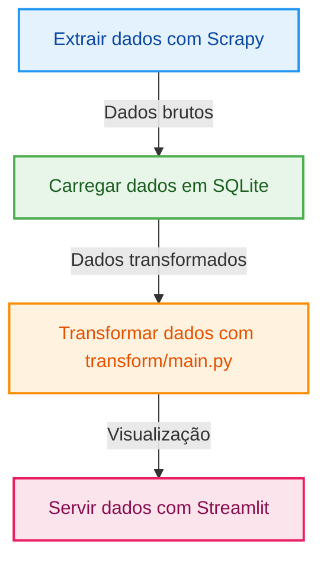


# MercadoLivre Scrapy

Este projeto extrai dados do Mercado Livre usando Scrapy, transforma os dados e os serve por meio de um dashboard ou API.

## 🧱 Estrutura do Projeto

```
MERCADOLIVRE_SCRAPY/
├── .ruff_cache/                 
├── data/
│   └── data.db                  # Banco de dados SQLite
├── docs/
├── mercadolivre_scrapy/        # Pacote principal do projeto
│   ├── dashboard/
│   │   └── app.py               # Streamlit App
│   ├── extract/
│   │   ├── __init__.py
│   │   ├── items.py             # Definições dos items Scrapy
│   │   ├── settings.py          # Configurações do Scrapy
│   │   └── spiders/
│   │       ├── __init__.py
│   │       └── mercadolivre.py  # Spider principal
│   ├── transform/
│   │   ├── __init__.py
│   │   └── main.py              # Script de transformação
├── tests/                       # Testes automatizados
├── scrapy.cfg                   # Configuração principal do Scrapy
├── .gitignore
├── gitdiff.bat
├── poetry.lock
├── pyproject.toml
└── README.md
```

## 🔄 Fluxo ELT





## 🚀 Primeiros Passos

### Instalação

```bash
poetry install
```

### Executar o Spider

```bash
cd mercadolivre_scrapy
scrapy crawl mercadolivre -o ../data/data.json
```

### Transformar os Dados

```bash
cd transform
python main.py
```

### Rodar o App

```bash
cd ../dashboard
streamlit run app.py
```

## 🧪 Testes

```bash
pytest
```

## 📁 Dados

- `data/data.db`: Banco SQLite para armazenar dados brutos e processados

## ⚙️ Configurações

- `scrapy.cfg`: Configuração do projeto Scrapy
- `settings.py`: Configurações específicas dos spiders
